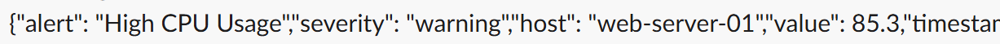
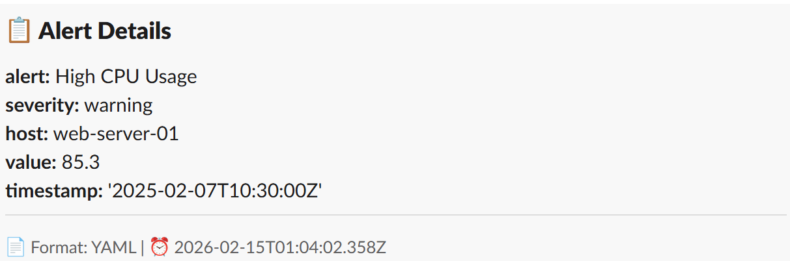
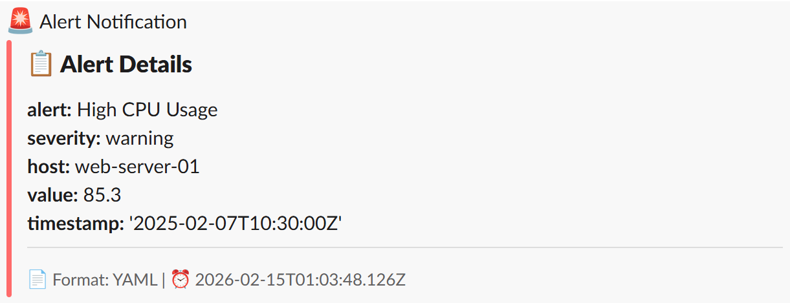

# Slack Webhook Relay - JSON to YAML Converter

> **Language**: [English](README.md) | [日本語](README-ja.md)

## Architecture


A JSON → YAML conversion relay API for Slack webhook notifications.  
Converts JSON payloads from alert notifications into a readable YAML format and sends them to Slack.

## Features

- **Automatic JSON to YAML Conversion**: Improves readability of alert contents
- **Three Display Modes**:
  - **block Mode (Default)**: Formatted display with bold keys (no attachment)
  - **attachments Mode**: Color-coded sidebar + bold key snippet-style display
  - **simple Mode**: Plain YAML without formatting
- **Multiple Webhook Support**: Dynamically specify destinations via query parameters
- **Multi-Cloud**: Deployable to both AWS Lambda and OCI Functions
- **Infrastructure as Code**: Fully automated with Terraform
- **Lightweight**: Only dependency is `js-yaml` (uses Node.js standard fetch)

## Usage

Simply call the API with your Slack Incoming Webhook URL as the value of the query parameter `d`

### Basic Examples

**block Mode (Default):**

```bash
curl -X POST "https://api.example.com/?d=https://hooks.slack.com/services/YOUR/WEBHOOK/PATH" \
  -H "Content-Type: application/json" \
  -d '{
    "alert": "High CPU Usage",
    "severity": "warning",
    "host": "web-server-01",
    "value": 85.3,
    "timestamp": "2025-02-07T10:30:00Z"
  }'
```

**attachments Mode (Snippet-style display):**

```bash
curl -X POST "https://api.example.com/?d=https://hooks.slack.com/services/YOUR/WEBHOOK/PATH&mode=attachments" \
  -H "Content-Type: application/json" \
  -d '{
    "alert": "High CPU Usage",
    "severity": "warning",
    "host": "web-server-01",
    "value": 85.3,
    "timestamp": "2025-02-07T10:30:00Z"
  }'
```

**simple Mode (Unformatted):**

```bash
curl -X POST "https://api.example.com/?d=https://hooks.slack.com/services/YOUR/WEBHOOK/PATH&mode=simple" \
  -H "Content-Type: application/json" \
  -d '{
    "alert": "High CPU Usage",
    "severity": "warning",
    "host": "web-server-01",
    "value": 85.3,
    "timestamp": "2025-02-07T10:30:00Z"
  }'
```

### Display in Slack

**Before Conversion (Regular JSON)**

- Unformatted and difficult to read

  

**After Conversion - block Mode (Default)**

- Formatted YAML display with bold keys (no attachment)

  

**After Conversion - attachments Mode (Snippet-style display)**

- Snippet-style display using Attachments with bold keys and color-coded sidebar for improved visibility (note: can be removed if needed)

  

**After Conversion - simple Mode**

- Plain YAML displayed in code block without decoration

  

### Sending Plain Text

```bash
# Plain text can also be sent as-is
curl -X POST "https://api.example.com/webhooks?d=https://hooks.slack.com/services/YOUR/WEBHOOK/PATH" \
  -H "Content-Type: text/plain" \
  -d "Server started successfully"
```

## Technology Stack

- **Runtime**: Node.js 20+ (AWS Lambda) / Node.js 25 (OCI Functions)
- **Dependencies**:
  - `js-yaml` - YAML conversion
  - Node.js standard `fetch` - HTTP communication (no external library needed)
- **Infrastructure**: Terraform

## Quick Start

### Deploy to AWS Lambda

```bash
# Install dependencies
cd src
npm install

# Run deployment script
cd ..
./deploy-aws.sh

# Or manually run Terraform
cd terraform/aws
terraform init
terraform plan
terraform apply

# Check Function URL
terraform output function_url
```

### Deploy to OCI Functions

```bash
# Set environment variables
export OCI_REGION="ap-tokyo-1"
export OCI_TENANCY_NAMESPACE="your-tenancy-namespace"
export TENANCY_OCID="ocid1.tenancy.oc1..xxxxx"
export COMPARTMENT_ID="ocid1.compartment.oc1..xxxxx"
export SUBNET_IDS='["ocid1.subnet.oc1..xxxxx"]'
export GATEWAY_SUBNET_ID="ocid1.subnet.oc1..xxxxx"

# Run deployment script
./deploy-oci.sh

# Or deploy manually
docker build -t ${OCI_REGION}.ocir.io/${OCI_TENANCY_NAMESPACE}/slack-webhook-relay-repo:latest .
docker push ${OCI_REGION}.ocir.io/${OCI_TENANCY_NAMESPACE}/slack-webhook-relay-repo:latest

cd terraform/oci
terraform init
terraform apply
```

## API Specification

### Endpoint

```
POST /webhooks
```

### Query Parameters

| Parameter | Required | Description          | Example                                        |
| --------- | -------- | -------------------- | ---------------------------------------------- |
| d         | ✓        | Destination Slack Webhook URL | `https://hooks.slack.com/services/XXX/YYY/ZZZ` |
| mode      | -        | Display mode         | `simple`, `block`, `attachments` (default: `block`) |

**Mode Description**:

- **`mode=simple`**: Plain YAML without syntax highlighting displayed in code block. No color-coded sidebar or bold formatting. Lightweight and simple display
- **`mode=block`** (default): Formatted YAML displayed directly in blocks. Lightweight as it doesn't use attachments
- **`mode=attachments`**: Snippet-style display with color-coded sidebar and bold formatting for high visibility

### Request Body

- **Content-Type**: `application/json` or `text/plain`
- JSON format is automatically converted to YAML
- Plain text is sent as-is

### Response

**Success (200 OK)**

```json
{
  "message": "Successfully sent to Slack",
  "converted": true,
  "destination": "https://hooks.slack.com/***"
}
```

**Error (400 Bad Request)**

```json
{
  "error": "Missing required parameter: d (destination webhook URL)"
}
```

## Integration with Monitoring Alerts

### Prometheus Alertmanager

```yaml
receivers:
  - name: "slack-webhook-relay"
    webhook_configs:
      - url: "https://api.example.com/webhooks?d=https://hooks.slack.com/services/XXX/YYY/ZZZ"
        send_resolved: true
```

### Grafana

```json
{
  "type": "webhook",
  "url": "https://api.example.com/webhooks?d=https://hooks.slack.com/services/XXX/YYY/ZZZ",
  "httpMethod": "POST"
}
```

### CloudWatch Alarms (AWS)

Can be integrated in SNS → Lambda → Webhook Relay → Slack configuration

## Terraform Variables

### AWS Lambda

| Variable Name      | Default             | Description          |
| ------------------ | ------------------- | -------------------- |
| aws_region         | ap-northeast-1      | AWS Region           |
| function_name      | slack-webhook-relay | Lambda Function Name |
| lambda_timeout     | 30                  | Timeout (seconds)    |
| lambda_memory_size | 256                 | Memory Size (MB)     |
| log_retention_days | 14                  | Log Retention (days) |

### OCI Functions

| Variable Name        | Default             | Description                                 |
| -------------------- | ------------------- | ------------------------------------------- |
| oci_region           | ap-tokyo-1          | OCI Region                                  |
| compartment_id       | -                   | Compartment OCID (required)                 |
| tenancy_ocid         | -                   | Tenancy OCID (required, for dynamic groups) |
| tenancy_namespace    | -                   | Tenancy Namespace (required, for OCIR)      |
| function_name        | slack-webhook-relay | Function Name                               |
| function_timeout     | 30                  | Timeout (seconds)                           |
| function_memory_mb   | 256                 | Memory Size (MB)                            |
| subnet_ids           | -                   | Subnet ID List (required)                   |
| gateway_subnet_id    | -                   | API Gateway Subnet (required)               |
| enable_rate_limiting | false               | Enable Rate Limiting                        |
| log_retention_days   | 30                  | Log Retention (days)                        |

## Security

### Webhook URL Validation

- Only official Slack webhook URLs are allowed
- URL validation is implemented

### CORS Configuration

For AWS Lambda Function URL, the following CORS settings are applied:

- Only POST method allowed
- Only necessary headers allowed

### Rate Limiting

OCI:

```hcl
variable "enable_rate_limiting" {
  default = true
}
variable "rate_limit_rps" {
  default = 100
}
```

AWS Lambda Function URL doesn't have native rate limiting, but you can implement rate limiting within the Lambda function or add AWS WAF if needed.

### Log Management

- All requests are logged to CloudWatch Logs/OCI Logging
- Webhook URLs are partially masked
- Detailed error logging

## Troubleshooting

### Lambda Deployment Error

```bash
# Check ZIP file size
du -h terraform/aws/slack-webhook-relay.zip

# Reinstall dependencies
cd src
rm -rf node_modules
npm install --production
```

### OCI Functions Image Push Error

```bash
# Re-authenticate to OCIR
docker login ${OCI_REGION}.ocir.io

# Rebuild and push image
docker build -t ${OCI_REGION}.ocir.io/${OCI_TENANCY_NAMESPACE}/slack-webhook-relay-repo:latest .
docker push ${OCI_REGION}.ocir.io/${OCI_TENANCY_NAMESPACE}/slack-webhook-relay-repo:latest
```

### Slack Sending Error

```bash
# Check logs (AWS)
aws logs tail /aws/lambda/slack-webhook-relay --follow

# Check logs (OCI)
oci logging-search search-logs \
  --search-query "search \"<log-group-id>\" | sort by datetime desc"
```

## Cost Estimation

### AWS Lambda (Using Function URL)

- Requests: 1 million/month → ~$0.20
- Execution time: 30 seconds, 256MB → ~$0.83
- **Total**: ~$1.03/month

**~70% cost reduction compared to traditional API Gateway setup!**

### OCI Functions

- Requests: 1 million/month → ~$0.20
- Execution time: 30 seconds, 256MB → ~$0.60
- API Gateway: 1 million requests → ~$3.00
- **Total**: ~$3.80/month

## License

MIT

See [CHANGELOG.md](CHANGELOG.md) for release history.
